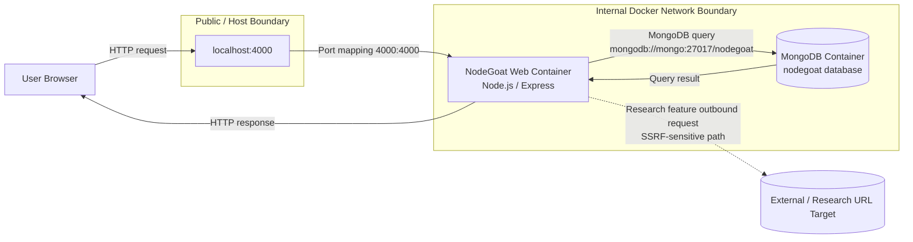

# NodeGoat Architecture and Trust Boundaries

## Overview

This project runs OWASP NodeGoat as a containerised web application. The main runtime components are:

- User browser
- NodeGoat Node.js/Express web container
- MongoDB database container
- Docker internal network
- Optional outbound path from the research feature

## Architecture Diagram

## Trust Boundaries

### TB1 — Browser to Web Application

The first trust boundary is between the user browser and the NodeGoat web application. All HTTP input from the browser is untrusted and must be validated before use.

Examples:

- Login data
- Allocation threshold values
- URL parameters
- Form fields
- Research feature URL input

### TB2 — Web Container to Database Container

The second trust boundary is between the NodeGoat web container and the MongoDB container. The database is internal to the Docker network, but unsafe queries can still expose or manipulate data.

Example from V2:

- Unsafe `$where` query construction allowed user input to become server-side JavaScript.
- The fix removed `$where` and used a native MongoDB comparison operator.

### TB3 — Web Container to External URL Target

The research feature creates an outbound request path from the server. This is SSRF-sensitive because user-controlled URLs could make the server contact internal or external resources.

Recommended control:

- Use a strict allowlist of permitted destination hosts.
- Reject private IP ranges, localhost, and internal Docker service names.
- Apply request timeouts and safe error handling.

## Docker Runtime Notes

The Docker Compose setup runs two communicating services:

- `web`: builds and runs the NodeGoat application.
- `mongo`: runs MongoDB 4.4.

The hardened Compose configuration adds:

- MongoDB healthcheck
- Named MongoDB volume
- `depends_on` with `condition: service_healthy`
- Removal of obsolete Compose `version` field
